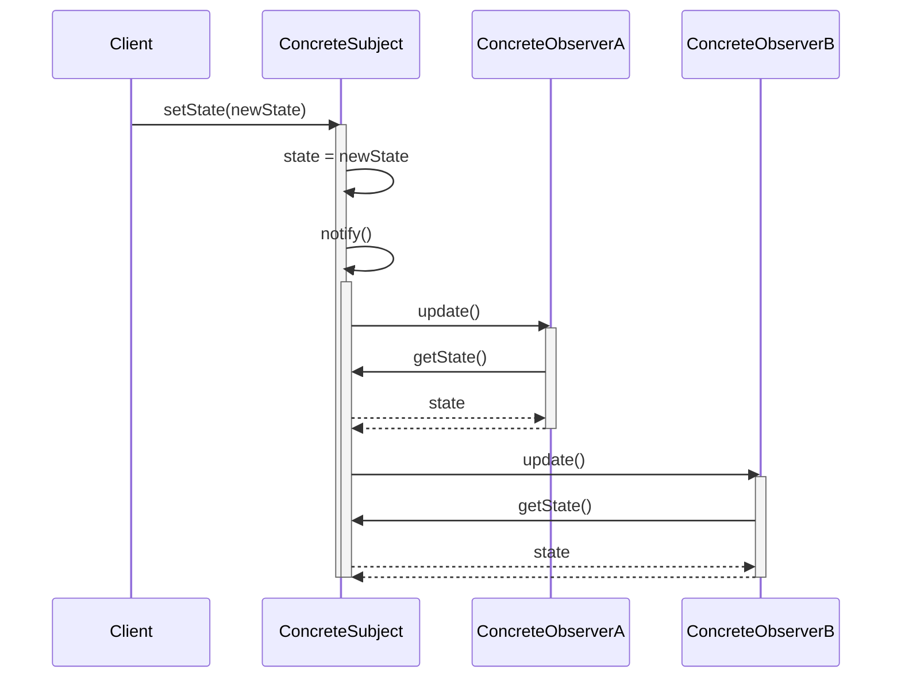

# Observer Pattern

- **Type:** Behavioral
- **Kernidee:** Definieer een één-op-veel-afhankelijkheid tussen objecten, zodat wanneer één object van staat verandert, al zijn afhankelijke objecten automatisch op de hoogte worden gebracht en bijgewerkt.

---

## A. Wat is het kernprobleem?

Stel je hebt een object (de `Subject`) waarvan de data kan veranderen. Meerdere andere objecten (de `Observers`) zijn geïnteresseerd in die data en moeten hun eigen staat aanpassen wanneer de data van de `Subject` wijzigt.

Hoe zorg je ervoor dat:
1.  De `Subject` niet vastzit aan concrete `Observers`? Hij moet niet weten *wie* of *wat* de observers zijn, enkel *dat* ze er zijn.
2.  Je op elk moment nieuwe `Observers` kunt toevoegen of verwijderen zonder de `Subject` te moeten aanpassen?

Het probleem is het creëren van een losgekoppeld systeem voor notificaties.

---

## B. Intuïtieve uitleg

Stel je een abonnement op een tijdschrift voor.
-   De **uitgever** is de `Subject`.
-   De **abonnees** zijn de `Observers`.

De uitgever houdt een lijst bij van al zijn abonnees. Wanneer er een nieuw tijdschrift uitkomt (de staat van de uitgever verandert), stuurt hij dit automatisch naar iedereen op zijn lijst.
-   De uitgever hoeft niet elke abonnee persoonlijk te kennen.
-   Abonnees kunnen zich op elk moment aan- of afmelden.

Het Observer Pattern formaliseert dit "abonnement"-mechanisme.

---

## C. Formele structuur & Interactiediagram

Het patroon bestaat typisch uit vier rollen:

1.  **Subject (Interface):** Definieert de methodes om observers te registreren (`attach`), te verwijderen (`detach`) en op de hoogte te brengen (`notify`).
2.  **ConcreteSubject:** Implementeert de `Subject`-interface. Houdt een lijst van observers bij en stuurt een notificatie wanneer zijn staat (`state`) verandert.
3.  **Observer (Interface):** Definieert de update-methode (`update`) die door de `Subject` wordt aangeroepen.
4.  **ConcreteObserver:** Implementeert de `Observer`-interface. Houdt een referentie naar een `ConcreteSubject` om data op te vragen en reageert op de `update` notificatie.

### Sequentiediagram (Examenvereiste)

Dit diagram modelleert hoe een `ConcreteSubject` zijn `ConcreteObserver`s op de hoogte brengt.

**Werking van het diagram:**
1.  De `Client` verandert de staat van de `ConcreteSubject`.
2.  De `ConcreteSubject` roept zijn eigen `notify()` methode aan.
3.  De `Subject` loopt door zijn lijst van `Observer`s en roept op elk van hen de `update()` methode aan.
4.  Elke `Observer` vraagt de nieuwe staat op bij de `Subject` via `getState()` om zichzelf bij te werken.

---

## D. Toepassing & Examengerichte vertaling

*   **Hoe kan dit terugkomen op het examen?**
    *   Teken een sequentiediagram voor het Observer Pattern.
    *   Je krijgt een scenario (bv. een veilingsysteem waar bieders genotificeerd moeten worden) en moet dit modelleren met het Observer Pattern.
    *   Uitleggen hoe dit patroon het **Open-Closed Principle** en **Dependency Inversion Principle** toepast.
        - **OCP:** Je kan nieuwe `Observer`s toevoegen zonder de `Subject` te wijzigen.
        - **DIP:** De `ConcreteSubject` hangt af van de `Observer`-interface (abstractie), niet van `ConcreteObserver`s (details).
*   **Variaties:**
    *   **Push Model:** De `Subject` stuurt de nieuwe data mee met de `update(data)` call. De `Observer` hoeft dan niet zelf `getState()` aan te roepen.
    *   **Pull Model:** Zoals hierboven getoond. De `Subject` stuurt enkel een notificatie. De `Observer` is zelf verantwoordelijk voor het "trekken" van de data die hij nodig heeft.
*   **Wat moet ik zeker begrijpen?**
    *   Het doel is **loskoppeling (loose coupling)**. De `Subject` en `Observers` kennen elkaar enkel via abstracte interfaces.
    - Dit patroon maakt de basis uit van veel UI-frameworks (bv. event listeners in Java Swing/FX) en Model-View-Controller (MVC) architecturen.
